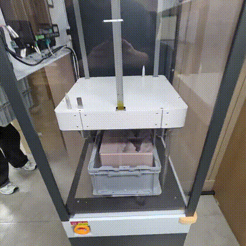
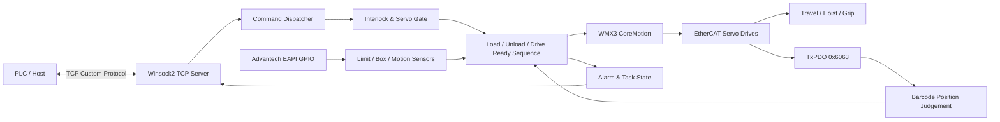
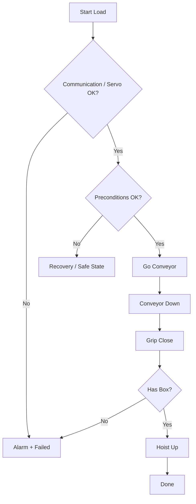

# OHT Motion Control & PLC Automation System

> **C++ / WMX3 / EtherCAT 기반 OHT 실장비 제어 및 PLC 연동 프로젝트**  
> 주행·승강·그리퍼 제어부터 Load/Unload 자동 시퀀스, TCP 명령 프로토콜, Drive Ready, 인터록 및 알람 처리까지 통합했습니다.

<p align="left">
  
  
  
  
  
  
</p>

---

## Portfolio Snapshot

| 구분 | 내용 |
|---|---|
| **Project** | OHT Motion Control & PLC Automation |
| **Role** | Robot Motion / Sequence / PLC Communication Software Development |
| **Language** | C++17 |
| **UI** | Win32 API |
| **Motion API** | SoftServo WMX3 / CoreMotion |
| **Fieldbus** | EtherCAT, TxPDO `0x6063` feedback |
| **Communication** | Winsock2 TCP Server, custom frame protocol |
| **I/O** | Advantech Platform SDK EAPI GPIO |
| **Control Scope** | Travel, Hoist, Grip, Load/Unload, Stop/Reset, Drive Ready, Alarm, Manual/Auto |
| **Key Point** | PLC 명령과 실제 센서 상태를 연결해 안전한 자동 물류 시퀀스를 실행하는 통합 제어 |

### 한 줄 요약

**PLC가 명령을 보내면 OHT가 단순히 축을 움직이는 것이 아니라, Servo·센서·현재 위치·박스 유무·인터록을 확인하고 동작 완료까지 추적한 뒤 ACK/DONE 상태를 반환하도록 만든 실장비 제어 시스템입니다.**

---

## 🎥 Robot Demo Video

원광대 현장에서 촬영한 OHT 실장비 구동 영상을 포트폴리오에 포함했습니다. **아래 GIF를 클릭하면 전체 동작 영상으로 이동합니다.**

[](./assets/videos/oht_full_demo.mp4)

### Full OHT Demo

- **Video**: [`assets/videos/oht_full_demo.mp4`](./assets/videos/oht_full_demo.mp4)
- **Length**: 약 **3분 32초**
- **Format**: H.264 MP4, GitHub/브라우저 재생 호환성을 고려한 포트폴리오용 변환본
- **Preview**: `assets/images/oht_demo.gif`

#### 영상에서 확인할 수 있는 내용

- 현장 HMI 조작부터 OHT 동작까지 이어지는 실제 운용 흐름
- 천장 레일을 따라 이동하는 OHT 주행
- Hoist/승강부와 적재함을 이용한 물류 이송 동작
- 현장 설비와 연계된 반복 운전 및 위치 이동
- 코드에서 구현한 **PLC Communication / Motion / Interlock / Sequence 제어가 실장비에서 동작하는 결과**

> 단순 시뮬레이션이 아니라 실제 설치 환경에서 구동되는 장비를 함께 보여주도록 구성해, 소스코드와 실장비 결과를 한 번에 확인할 수 있습니다.

## Project Overview

OHT 제어에서는 세 가지 레이어를 동시에 다뤄야 합니다.

1. **Motion Layer**  
   Servo axis를 실제 목표 위치까지 움직이고 정지 상태를 검증합니다.

2. **Machine State Layer**  
   현재 주행 위치, Hoist 위치, Grip 위치, Box 유무, Limit sensor를 조합해 장비의 실제 상태를 판단합니다.

3. **PLC Interface Layer**  
   외부 PLC command를 수신하고 ACK / DONE / Alarm / Drive Ready 상태를 프로토콜로 반환합니다.

이 프로젝트는 세 레이어를 하나의 Win32 C++ 애플리케이션에 통합합니다.

---

## System Architecture



---

## Core Features

### 1. OHT motion control

주요 장비 동작을 독립 Task로 구성했습니다.

| Motion | Description |
|---|---|
| `GO_Conveyor()` | Conveyor 위치 이동 |
| `Go_Workstation()` | Workstation 이동 |
| `Go_Maintenance()` | Maintenance 위치 이동 |
| `DoUp()` | Hoist Up |
| `WorkDown()` | Workstation 높이로 Down |
| `ConveyorDown()` | Conveyor 높이로 Down |
| `DoOpen_Compat()` | Grip Open |
| `DoClose_Compat()` | Grip Close |
| `DoStopAll()` | 전체 Motion Stop |

각 동작은 통신 시작 여부, Servo 상태, 위치 및 센서 조건을 확인하고 `TaskState`로 실행 상태를 관리합니다.

### 2. Barcode-based travel positioning

주행 위치는 EtherCAT TxPDO `0x6063` 값을 기준으로 판단합니다.

```text
Current 0x6063
      ↓
Target Barcode
      ↓
Direction / Error
      ↓
Coarse Move
      ↓
Fine Correction
      ↓
Stopped + In Position
```

단순 Pulse target만 사용하는 대신 장비에서 읽히는 실제 position feedback을 활용해 Conveyor / Workstation / Maintenance 위치 도달을 판정합니다.

### 3. Automatic Load sequence

`StartDemoLoad()`는 단일 버튼 동작이 아니라 실제 장비 상태를 검증하는 자동 시퀀스입니다.



주요 검증 항목은 다음과 같습니다.

- WMX communication 상태
- Axis Servo On 상태
- Conveyor position
- Hoist Up / Down 위치
- Grip Open / Closed 위치
- `HasBox()` sensor
- 각 단계 Timeout

### 4. Automatic Unload sequence

Unload에서는 Workstation 위치로 이동한 뒤 박스를 놓고 안전 위치로 복귀하는 흐름을 수행합니다.

```text
Go Workstation
   ↓
Work Down
   ↓
Grip Open
   ↓
NoBox 확인
   ↓
Hoist Up
   ↓
Go Conveyor
   ↓
Done
```

각 단계에서 sensor feedback을 확인하므로, 명령 전달과 실제 장비 상태가 불일치하면 `Failed`와 Alarm으로 전환됩니다.

### 5. PLC TCP command protocol

Winsock2 기반 TCP server를 구현해 PLC command를 수신합니다.

코드에는 다음과 같은 명령 흐름이 포함되어 있습니다.

- Load request
- Unload request
- Stop
- Reset
- Travel position command
- Hoist position command
- Grip position command
- Drive Ready request
- Communication open
- ACK / DONE handshake

Frame은 STX/ETX를 포함한 custom binary protocol 형태로 처리되며, command 실행 중 중복 명령을 차단하고 완료 시 DONE을 전송합니다.

```text
PLC Request
    ↓
Frame Validation
    ↓
Servo / Stop Latch / Busy / Interlock Check
    ↓
ACK
    ↓
Motion Sequence
    ↓
Sensor-based Completion
    ↓
DONE or Alarm
```

### 6. Stop / Reset safety state

Stop command 수신 시 진행 중인 Motion을 정지시키고 추가 명령을 차단하는 latch를 사용합니다.

Reset 명령이 들어오기 전까지 Travel / Hoist / Grip 명령이 재실행되지 않도록 하여 Stop 직후 예기치 않은 재기동을 방지합니다.

### 7. Drive Ready sequence

Drive Ready는 단순 Boolean 설정이 아니라 실제 장비 상태를 정리한 후 완료됩니다.

예를 들어 다음 조건을 확인합니다.

- Grip position이 유효한 상태인지
- Box 유무에 맞는 Grip 상태인지
- Hoist가 Up 위치인지
- Servo gate가 정상인지
- Stop latch가 해제되어 있는지

필요하면 Grip / Hoist를 자동으로 정상 위치로 이동한 뒤 최종 조건이 만족되었을 때 `driveReady = true`로 전환합니다.

### 8. Alarm latching

자동 시퀀스 실패 원인을 코드로 관리합니다.

예를 들어 Load에서는 다음과 같은 실패를 구분합니다.

```text
0x10  Load precondition failure
0x11  Conveyor travel timeout
0x12  Conveyor down timeout
0x13  Grip close timeout
0x14  Box not caught
0x15  Hoist up timeout
0x30~ Servo state errors
```

첫 에러를 유지하는 Latch 방식으로 후속 오류가 최초 원인을 덮어쓰지 않도록 했습니다.

### 9. Hardware I/O & debounce

Advantech EAPI 기반 GPIO 제어 기능을 포함합니다.

- GPIO enumeration
- DI / DO direction setup
- DI sensor monitoring
- DO output control
- Majority sampling debounce
- Hardware state ↔ Win32 UI sync

### 10. Error manual viewer

`fastech_errors.json`, `welcon_errors.json`을 읽어 장비 에러 코드 검색 UI를 제공합니다.

검색 기능은 다음을 지원하도록 구성되어 있습니다.

- Error code search
- Exact code filtering
- Multi-keyword filtering
- Vendor / Name / Category / Cause / Action 표시

현장 디버깅 시 별도 문서를 찾는 시간을 줄이고 프로그램 안에서 원인과 조치 항목을 확인할 수 있도록 구성했습니다.

---

## Task State Model

```cpp
enum class TaskState {
    Idle,
    Running,
    Done,
    Failed,
    Stopped
};
```

자동 시퀀스는 `WaitUntil()`과 `WaitTaskFinished()`를 이용해 각 단계 완료를 기다립니다.

이 구조의 장점은 다음과 같습니다.

- 단계별 Timeout 적용
- 실패 시 즉시 다음 동작 중단
- UI 상태 표시와 실제 로직의 상태 통합
- TCP DONE 전송 시점 명확화
- Stop 상태 추적 가능

---

## Manual / Auto Mode

Manual과 Auto의 제어 경로를 분리했습니다.

### Manual

- 개별 Axis test
- Jog / Absolute / Relative move
- Servo control
- GPIO test
- Hardware commissioning

### Auto

- PLC command execution
- Load / Unload sequence
- Travel / Hoist / Grip command
- Machine interlock
- Drive Ready
- Stop / Reset state machine

Auto mode에서 조건이 맞지 않으면 축 명령을 차단하고 인터록 상태 또는 Alarm으로 처리합니다.

---

## Software Structure

```text
OHT_Wongwang_final-master/
├─ oht_main.cpp          # Main Win32 UI, WMX3 initialization,
│                        # TCP server/protocol, Manual/Auto, interlock,
│                        # error viewer, monitoring and motion utilities
├─ DemoControl.cpp       # OHT motion functions, Load/Unload sequences,
│                        # grip/hoist logic, alarm handling, sensor checks
├─ DemoShared.h          # Shared motion/task declarations
├─ GPIO_Control.cpp      # Advantech EAPI GPIO diagnostic/control UI
├─ MapView.cpp/.h        # Graphical map / station visualization module
├─ fastech_errors.json   # Fastech error manual data
├─ welcon_errors.json    # Welcon error manual data
├─ OHT.sln               # Visual Studio solution
├─ OHT.vcxproj           # C++ project configuration
└─ assets/
   ├─ videos/            # OHT operation videos
   └─ images/            # GIF / screenshot / thumbnail
```

---

## Tech Stack

### Application

- **C++17**
- **Win32 API**
- **Visual Studio / MSVC v143**
- `std::thread`, `std::atomic`
- JSON-based error data

### Motion / Fieldbus

- **SoftServo WMX3**
- **CoreMotion API**
- **EtherCAT / EcApi**
- TxPDO / position feedback (`0x6063`)
- Servo status / actual position / actual velocity monitoring

### Communication / I/O

- **Winsock2 TCP/IP**
- Custom PLC binary frame protocol
- **Advantech Platform SDK EAPI**
- Digital Input / Output

---

## Build Environment

프로젝트 설정 기준:

- Windows 10/11
- Visual Studio with **Platform Toolset v143**
- C++17
- SoftServo WMX3 SDK / Runtime
- Advantech Platform SDK EAPI

Configured include/library paths include:

```text
C:\Program Files\SoftServo\WMX3\Include
C:\Program Files\SoftServo\WMX3\Lib
C:\Program Files\Advantech\PlatFormSDK\EAPI\include\API
```

> 이 프로젝트는 실장비용 소프트웨어입니다. 전체 기능 실행에는 실제 EtherCAT topology, servo parameter, GPIO hardware, PLC/host protocol 환경이 필요합니다.

---

## Engineering Challenges & Solutions

### Challenge 1. “명령 완료”와 “실제 장비 완료”의 차이

**Problem**  
Motion API 호출이 성공했더라도 장비가 실제 Target에 도달했거나 Grip이 박스를 잡았다는 뜻은 아닙니다.

**Solution**  
각 단계에서 위치, 속도, Limit, Grip state, `HasBox()`를 별도로 확인하고 완료 조건을 충족해야 다음 단계로 넘어가도록 구성했습니다.

### Challenge 2. PLC와 장비 상태 비동기 문제

**Problem**  
PLC request가 들어오는 시점과 실제 축 동작 완료 시점은 다릅니다.

**Solution**  
Request 수신 직후 ACK를 반환하고, 실제 Motion / Sensor verification이 끝난 후 DONE을 반환하는 비동기 구조를 적용했습니다.

### Challenge 3. Stop 이후 예기치 않은 재기동

**Problem**  
Stop 직후 외부에서 새 명령이 들어오면 장비가 즉시 재동작할 위험이 있습니다.

**Solution**  
Stop latch와 Servo gate를 두고 Reset 및 정상 상태 확인 전까지 Motion command를 차단했습니다.

### Challenge 4. 자동 시퀀스 시작 상태 불일치

**Problem**  
Load/Unload 시작 시 Hoist 또는 Grip이 중간 위치일 수 있습니다.

**Solution**  
Precondition 검사 후 필요한 경우 Up/Open/Close 등 안전 상태로 정리하는 recovery flow를 추가했습니다.

### Challenge 5. 현장 Error debugging

**Problem**  
Servo/drive 에러 발생 시 외부 매뉴얼에서 코드를 찾는 데 시간이 걸립니다.

**Solution**  
Fastech/Welcon 에러 JSON을 프로그램에 연결하고 검색 UI를 구현해 Cause / Action을 즉시 확인할 수 있게 했습니다.

---

## What This Project Demonstrates

이 프로젝트는 다음 로봇 소프트웨어 역량을 보여줍니다.

- **산업용 Motion API 기반 실장비 제어**
- **EtherCAT Servo / Position feedback 활용**
- **PLC ↔ PC TCP/IP 통신 프로토콜 구현**
- **Load / Unload 자동 Sequence 설계**
- **Sensor feedback 기반 완료 판정**
- **Interlock / Stop / Reset / Alarm 설계**
- **GPIO Hardware integration**
- **Multi-threaded asynchronous control**
- **현장 Debugging UI 및 Error manual integration**

---

## Demo Media Checklist

포트폴리오 제출 전 아래 자료를 추가하면 좋습니다.

- [x] OHT 전체 주행 영상
- [ ] Load 자동 시퀀스 영상
- [ ] Unload 자동 시퀀스 영상
- [ ] PLC 명령 → OHT 동작 → DONE 영상
- [ ] Stop / Reset 동작 영상
- [ ] Win32 제어 UI 캡처
- [ ] Error Manual 검색 화면
- [ ] EtherCAT / Servo / PLC 구성 사진

---

## Suggested Resume Bullet

README만 보는 채용 담당자가 아니라 이력서에도 프로젝트를 연결하고 싶다면 다음 정도로 요약할 수 있습니다.

> **C++/WMX3 기반 OHT 제어 SW 개발**: EtherCAT servo motion, TCP/IP PLC protocol, Load/Unload 자동 시퀀스, sensor interlock 및 Stop/Reset/Alarm state machine을 구현하여 실장비 자동 운전 로직 통합.

---

### Keywords

`Robotics` `OHT` `Motion Control` `C++` `WMX3` `EtherCAT` `PLC` `TCP/IP` `Servo` `Win32` `GPIO` `Automation` `Material Handling` `Sequence Control`
